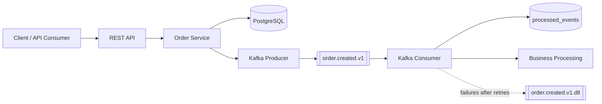

# Order Events Service

[](https://github.com/danielemasone/order-events-service/actions/workflows/ci.yml)


[](https://danielemasone.github.io/order-events-service/)
[](LICENSE)

Production-oriented Spring Boot microservice for creating orders, publishing Kafka events, consuming them idempotently, and publishing generated OpenAPI and JaCoCo documentation through GitHub Pages.

For local operation, API examples, generated documentation paths, and troubleshooting, see the [User Guide](docs/user-guide.md).

## What It Demonstrates

- Java 21 and Maven-only build
- Spring Boot REST API with request validation
- PostgreSQL persistence through Spring Data JPA
- Flyway-managed database schema
- Kafka producer and consumer with JSON events
- Idempotent consumer processing through a `processed_events` table
- Retry with fixed backoff and dead-letter routing to `order.created.v1.dlt`
- Runtime OpenAPI support and generated static OpenAPI documentation
- Docker Compose local environment
- JUnit 5 tests, Mockito, Spring Boot Test, Testcontainers for PostgreSQL
- JaCoCo coverage report and GitHub Pages publishing from `target/pages`

## Architecture



The REST API validates create-order requests and delegates to the order service. PostgreSQL stores orders and idempotency markers. Kafka carries `OrderCreatedEvent` messages on `order.created.v1`. The consumer records processed event IDs so duplicate deliveries become successful no-ops, while Spring Kafka centralizes retry and dead-letter routing to `order.created.v1.dlt`.

## GitHub Pages

GitHub Pages is published from the CI-generated `target/pages` artifact:

- [Landing page](https://danielemasone.github.io/order-events-service/)
- [User guide](https://danielemasone.github.io/order-events-service/docs/user-guide.md)
- [JaCoCo coverage](https://danielemasone.github.io/order-events-service/jacoco/)
- [OpenAPI documentation](https://danielemasone.github.io/order-events-service/openapi/)
- [OpenAPI JSON](https://danielemasone.github.io/order-events-service/openapi/openapi.json)

The repository Pages source must be set to **GitHub Actions**.

## Quick Start

Run infrastructure and the app locally:

```bash
docker compose up -d postgres kafka
./mvnw spring-boot:run
```

Run the full Docker Compose stack:

```bash
docker compose up --build
```

Run the main validation gate:

```bash
./mvnw clean verify
```

## CI Summary

`.github/workflows/ci.yml` runs on pushes to `main` and pull requests. It runs Maven verification, checks generated documentation artifacts, validates Docker Compose, builds the Docker image, uploads test reports, and deploys GitHub Pages only from `main`.

## Design Trade-offs

This project intentionally does not include Kubernetes, multiple services, saga orchestration, or schema registry. The goal is to keep the system small enough to review while still demonstrating event-driven reliability patterns.

The order creation flow publishes to Kafka after flushing the order row. A transactional outbox would be the next step if database-to-Kafka atomicity became the explicit focus.

The consumer uses an idempotency table because Kafka provides at-least-once delivery. Listener failures propagate to Spring Kafka so retry and DLT handling remain centralized.

The Docker image build intentionally skips test execution because the CI pipeline already validates the application through `./mvnw clean verify`.

This keeps verification and packaging concerns separated while avoiding duplicate test execution during image creation.


## License

Released under the MIT License. See [LICENSE](LICENSE).

Copyright (c) 2026 Daniele Masone.
