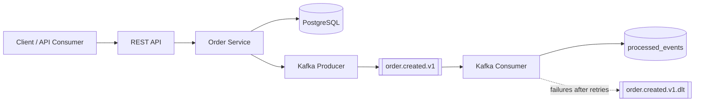

# Order Events Service

[](https://github.com/DanieleMasone/order-events-service/actions/workflows/ci.yml)
[](https://danielemasone.github.io/order-events-service/)
[](pom.xml)
[](pom.xml)
[](LICENSE)

Portfolio-grade, production-oriented Spring Boot service that creates orders, persists them in PostgreSQL, publishes `OrderCreatedEvent` records to Kafka, and consumes them idempotently. It demonstrates focused event-driven reliability patterns rather than a complete production platform.

For API examples, platform-specific commands, generated output paths, and troubleshooting, see the published [User Guide](https://danielemasone.github.io/order-events-service/docs/).

## What It Demonstrates

- Java 21 and a Maven Wrapper build
- Spring Boot REST API with validation and RFC 9457 Problem Details responses
- PostgreSQL persistence through Spring Data JPA and Flyway migrations
- Kafka JSON producer and consumer using record-level offset acknowledgment
- At-least-once delivery with atomic consumer deduplication in `processed_events`
- Three delivery attempts with fixed backoff, followed by routing to `order.created.v1.dlt`
- Runtime OpenAPI support plus generated static API documentation
- PostgreSQL integration tests with Testcontainers and behavior-focused Kafka tests
- Docker Compose, a non-root container image, JaCoCo, GitHub Actions, and GitHub Pages

## Architecture



The REST adapter validates create-order requests and delegates to `OrderService`. The service flushes the order row before publishing to Kafka. The consumer atomically claims each event ID in PostgreSQL with `ON CONFLICT DO NOTHING`; duplicate deliveries therefore complete as successful no-ops. Spring Kafka owns retry and DLT routing.

## Quick Start

Run PostgreSQL and Kafka in Docker, then start the application with Maven:

```bash
docker compose up -d postgres kafka
./mvnw spring-boot:run
```

Alternatively, build and run the complete stack:

```bash
docker compose up --build
```

Run the main validation gate:

```bash
./mvnw clean verify
```

## Runtime Endpoints

These URLs are available only while the application is running locally:

| Purpose | Endpoint |
| --- | --- |
| Create an order | `POST http://localhost:8080/api/orders` |
| Health | `GET http://localhost:8080/actuator/health` |
| Swagger UI | `http://localhost:8080/swagger-ui.html` |
| OpenAPI JSON | `http://localhost:8080/v3/api-docs` |

## Documentation

GitHub Pages publishes the Maven-generated `target/pages` artifact:

- [Project landing page](https://danielemasone.github.io/order-events-service/)
- [User Guide](https://danielemasone.github.io/order-events-service/docs/)
- [OpenAPI documentation](https://danielemasone.github.io/order-events-service/openapi/)
- [OpenAPI JSON](https://danielemasone.github.io/order-events-service/openapi/openapi.json)
- [JaCoCo coverage report](https://danielemasone.github.io/order-events-service/jacoco/)
- [Source repository](https://github.com/DanieleMasone/order-events-service)

Local generated outputs include `target/pages/docs/index.html`, `target/pages/openapi/index.html`, `target/pages/openapi/openapi.json`, and `target/pages/jacoco/index.html`. Generated documentation is never committed. GitHub Pages must use **GitHub Actions** as its source.

## Testing

`./mvnw clean verify` runs service, web, mapping, Kafka producer/consumer, retry/DLT, idempotency, application-context, OpenAPI, and documentation-artifact tests. Repository behavior and Flyway migrations are exercised against PostgreSQL with Testcontainers. Kafka collaboration and error-handler behavior are tested without starting a real broker; the suite does not claim broker-backed end-to-end coverage.

JaCoCo writes its HTML report to `target/site/jacoco/index.html` and Maven copies it into the Pages artifact.

## CI/CD

The `CI` workflow runs on pull requests and pushes to `main`. It executes Maven verification once, checks all generated Pages files, validates Docker Compose, and builds the application image. Surefire reports are uploaded only when the job fails. Successful `main` builds publish and deploy `target/pages` through the official GitHub Pages actions; pull requests never deploy.

## Design Trade-offs

- PostgreSQL persistence and Kafka publication are coordinated in application flow but are not atomic across both resources. A transactional outbox is intentionally outside this repository's scope.
- Kafka delivery is at-least-once. Atomic insertion into `processed_events` makes duplicate consumption a successful no-op; exactly-once delivery is not claimed.
- Schema registry, distributed tracing, Kubernetes, saga orchestration, and additional services are excluded because they are not needed to demonstrate this focused flow.
- The Docker image build skips tests because CI already runs the complete Maven verification gate before building the image.

## License

Released under the [MIT License](LICENSE).

Copyright (c) 2026 Daniele Masone.
