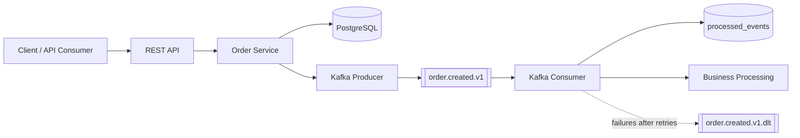

# Order Events Service

Production-oriented event-driven Spring Boot microservice for creating orders, publishing Kafka events, consuming those events idempotently, and documenting the build with OpenAPI, JaCoCo, Docker, and GitHub Pages.

## What It Demonstrates

- Java 21 and Maven-only build
- Spring Boot REST API with request validation
- PostgreSQL persistence through Spring Data JPA
- Flyway-managed database schema
- Kafka producer and consumer with JSON events
- Idempotent consumer processing through a `processed_events` table
- Retry with fixed backoff and dead-letter routing to `order.created.v1.dlt`
- Runtime OpenAPI support and generated static OpenAPI documentation
- Docker Compose local environment
- JUnit 5 tests, Mockito, Spring Boot Test, Testcontainers for PostgreSQL
- JaCoCo coverage report under `target/site/jacoco`
- GitHub Pages artifact assembled under `target/pages`

## Architecture

The service keeps one focused workflow.



Responsibilities:

- REST API validates create-order requests and returns the persisted order contract.
- PostgreSQL stores orders and the `processed_events` idempotency markers.
- Kafka topic `order.created.v1` carries `OrderCreatedEvent` messages keyed by event ID.
- Kafka consumer records processed event IDs so duplicate deliveries are acknowledged without duplicate side effects.
- Retry and DLT handling are delegated to Spring Kafka; exhausted records are published to `order.created.v1.dlt`.

When a client creates an order, the application persists the order and publishes an `OrderCreatedEvent`. The consumer stores the event ID in `processed_events` after successful processing. If the same Kafka event is delivered again, the consumer sees the existing event ID and exits successfully, allowing the offset to be committed without duplicating side effects.

## Runtime Endpoints

- REST API: `POST http://localhost:8080/api/orders`
- OpenAPI JSON while running locally: `http://localhost:8080/v3/api-docs`
- Swagger UI for local development: `http://localhost:8080/swagger-ui.html`
- Actuator health: `http://localhost:8080/actuator/health`

Example request:

```http
POST http://localhost:8080/api/orders
Content-Type: application/json

{
  "customerId": "customer-001",
  "amount": 199.90
}
```

## Local Development

Start PostgreSQL and Kafka in Docker, then run the Spring Boot app from the IDE or Maven:

```bash
docker compose up -d postgres kafka
./mvnw spring-boot:run
```

Run the complete local environment:

```bash
docker compose up --build
```

Useful validation commands:

```bash
./mvnw clean verify
docker compose config
docker build -t order-events-service:local .
```

## Build Outputs

Generated files are intentionally produced under `target` and should not be committed.

- MapStruct implementations: `target/generated-sources/annotations`
- JaCoCo coverage report: `target/site/jacoco/index.html`
- OpenAPI export: `target/generated-docs/openapi/openapi.json`
- Static OpenAPI documentation: `target/generated-docs/openapi/index.html`
- GitHub Pages artifact: `target/pages`

The committed landing page source is the only HTML source file:

```text
src/site/index.html
```

During `./mvnw clean verify`, a Spring MockMvc test exports `/v3/api-docs` to `target/generated-docs/openapi/openapi.json`. The OpenAPI Generator Maven plugin renders static `html2` documentation from that JSON into `target/generated-docs/openapi/index.html`. Maven then copies the landing page, JaCoCo report, generated API documentation, and raw OpenAPI JSON into `target/pages`. The build fails if any published documentation file is missing, so Pages cannot silently deploy broken links.

## GitHub Pages

The CI workflow publishes GitHub Pages from `main` using the official Pages actions. In repository settings, set Pages source to **GitHub Actions** before expecting deployments to appear. Replace the placeholder repository URL after creating the GitHub repository:

- **Pages:** [danielemasone.github.io/order-events-service](https://danielemasone.github.io/order-events-service)
- **JaCoCo:** [danielemasone.github.io/order-events-service](https://danielemasone.github.io/order-events-service/jacoco/)
- **OpenAPI documentation:** [danielemasone.github.io/order-events-service](https://danielemasone.github.io/order-events-service/openapi/)
- **OpenAPI JSON:** [danielemasone.github.io/order-events-service](https://danielemasone.github.io/order-events-service/openapi/openapi.json)

Local Swagger UI remains available for development when the Spring Boot app is running, but GitHub Pages links to the generated static `/openapi/` documentation.

## Testing

Run all tests and reports:

```bash
./mvnw clean verify
```

The test suite covers:

- Order creation service behavior
- REST controller validation
- Kafka producer interaction
- Kafka consumer idempotency and duplicate handling
- Retry and DLT configuration wiring
- MapStruct mapping behavior
- PostgreSQL repository behavior with Testcontainers
- Spring application context startup
- OpenAPI JSON export and static documentation generation under `target/generated-docs/openapi`
- Landing page source links for generated documentation

Arquillian is intentionally not used. It is valuable for Java EE/Jakarta EE container-managed integration tests, but this service is a Spring Boot application. Spring Boot Test, MockMvc, Mockito, and Testcontainers exercise the relevant runtime boundaries with less configuration and less conceptual overhead.

## CI Pipeline

`.github/workflows/ci.yml` runs on pushes to `main` and pull requests. It:

1. Checks out the repository.
2. Sets up Java 21.
3. Runs `./mvnw -B clean verify`.
4. Verifies the generated Pages, JaCoCo, OpenAPI JSON, and static OpenAPI documentation files exist.
5. Validates Docker Compose.
6. Builds the Docker image.
7. Uploads test reports.
8. Uploads and deploys `target/pages` to GitHub Pages only from `main`.

## Design Trade-offs

This project intentionally does not include Kubernetes, multiple services, saga orchestration, or schema registry. The goal is to keep the system small enough to review while still demonstrating important event-driven reliability patterns.

The order creation flow publishes to Kafka after flushing the order row. This keeps the portfolio project simple and observable. In a system requiring stronger database-to-Kafka atomicity, the next step would be a transactional outbox and relay.

The consumer uses an idempotency table because Kafka provides at-least-once delivery. The listener lets persistence exceptions propagate so Spring Kafka retry and DLT handling can decide whether to retry or recover the record.

## License

Released under the MIT License. See [LICENSE](LICENSE).

Copyright (c) 2026 Daniele Masone.
